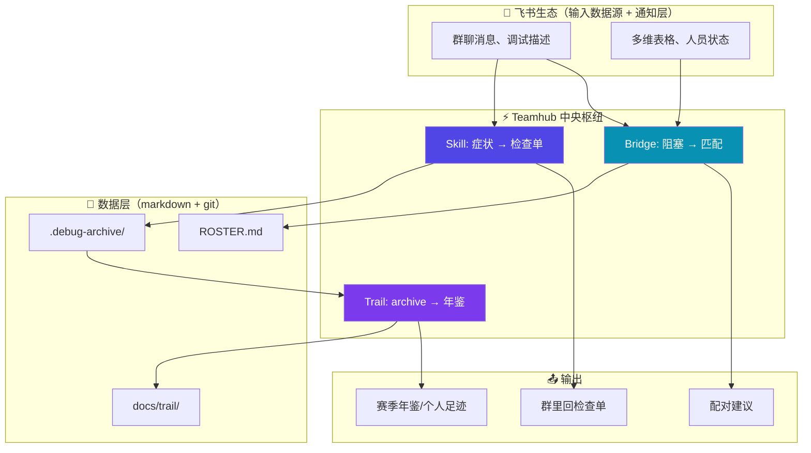
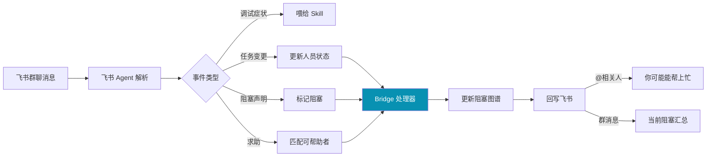
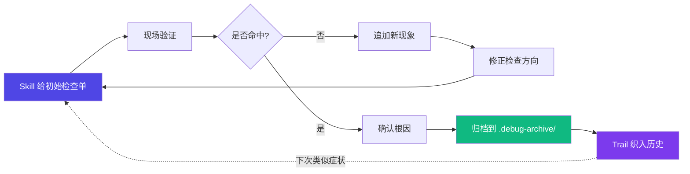
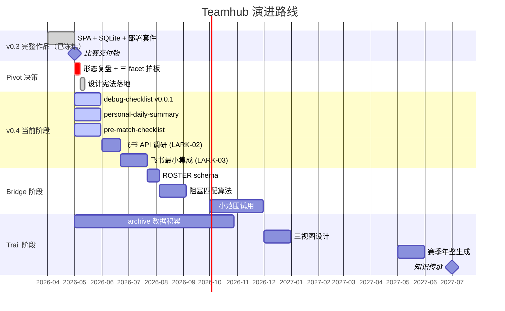

<div align="center">

# ⚡ Teamhub

### 机器人战队的协作中枢 · CASE 工具 + 团队交流中心 + 战队数据库

**给学长减负 + 给学弟指引 + 项目同步进度表。<br />
进度卡住、当事人又羞于开口时，靠"卡点在依赖图上自动可见"的结构替他说出来——规范团队、增强凝聚力，不监视个人。**

<br />


-orange)

</div>

---

## 一句话介绍

**Teamhub** 是机器人战队的**协作中枢**（CASE 工具 + 团队交流中心 + 战队数据库；5–15 人小作坊、无硬截止）。**系统是大脑、飞书是脸**：真相在系统关系库，飞书只做汇报 / 通知 / 一键 check-in，不双写。**核心不变式（D-037）**：人键信号只回本人当帮助、第三方只见结构键——**不监视个人**，公平靠给被卡的人正名。

四层架构（每层只依赖下层）：

```
①数据真相层      →  ②规则/协调层（魂）   →  ③展示/汇报层       →  ④触点/集成层
项目/赛季·成员       卡点/过载/缺口暴露      动态最短任务周期图      飞书是脸·Git
+角色+资历·组织树     被卡正名·给本人帮助     给老师的项目级汇报      Hermes/小龙虾
·依赖DAG·Need·档案库  (人键只回本人I0)      机会导向协调视图        /Claude Code
```

不做单体 issue tracker、不做产能排名（任何角色含老师都不得见）、**不对个人做活动监视**（人键信号只回本人）、不做完整 RBAC / 多租户 / 大型 PM。Skill / Bridge / Trail 作为能力 facet 归入四层架构。

> **本仓库源于战队调试现场的真实痛点**（见下文"痛点来源"），从"调试知识枢纽"逐步演进为进度治理系统（D-026）。README 是对外门面；内部事实源以 `AGENTS.md` + `docs/planning/` + `docs/design/` 为准。

---

## 痛点来源：真实调试现场

这个项目来自我在战队日常调试中的真实痛点。硬件调试现场的问题通常不是完整、安静、可以慢慢整理的。更多时候它们会突然出现：

- "串口又乱码了，但刚才好像还正常。"
- "CAN 总线偶发丢帧，复现条件不稳定。"
- "自动跑点方向不对，像是坐标系反了。"
- "换了一个参数后电机抖了一下，但日志没来得及截。"
- "这个问题以前好像遇到过，但我找不到当时怎么解决的。"

调试人员当下都在救火：看波形、接串口、改参数、重启设备、对比代码、和队友同步现象。结果是：

| 现场问题 | 直接后果 |
|---|---|
| 问题记录很碎 | 事后无法复盘 |
| 排查过程丢失 | 不知道当时为什么这么判断 |
| 历史经验分散 | 同类 bug 反复踩坑 |
| 描述口语化 | 难以沉淀成团队知识 |
| 解决后不归档 | 经验不能复用 |

Teamhub 想解决的，就是"调试知识从现场碎片到可复用资产"的最后一公里。

---

## 整体架构



整个系统没有新增数据库，没有新增 server。飞书 webhook / API 进来，markdown 出去，git 是唯一的事实源。

---

## 三个 facet

### 1️⃣ Skill 层 · 当下

**用法**：调试时直接和 Claude Code 说 "用 debug-checklist 帮我看下串口乱码"，按 SKILL.md 协议产出 5–8 条带依据和验证动作的清单。

已落地（都是 v0.0.1，自用 dogfood 中）：

| Skill | 场景 | 输入 | 输出 |
|---|---|---|---|
| `debug-checklist` | 调试现场要思路 | 一句话症状 | 5–8 条检查项，每条带依据 + 验证动作 |
| `personal-daily-summary` | 老师/学长问这周做了啥 | git log + 口述 | 可读的个人日报/周报 markdown |
| `pre-match-checklist` | 赛前一晚 | 比赛信息 | 装备/工具/备件/上电流程/分工清单 |

### 2️⃣ Bridge 层 · 现在

**目标**：让"谁在做什么、被什么卡住"自然可见。允许"导航任务卡了 3 天需要 RTOS 支援"，禁止"张三完成 5 个、李四完成 2 个"。



待启动：先做 LARK-02（飞书 API 调研），确认能力边界后才定 schema。

### 3️⃣ Trail 层 · 过去

**目标**：让 `.debug-archive/` 自动织成"我们这一年的样子"。三种视图：

- **个人足迹**：某队员一段时间的调试轨迹 + 周成长摘要
- **模块史**：视觉 / 电控 / 运动模块的历年踩坑与突破
- **赛季年鉴**：自动生成"这个赛季的故事"

启动条件：`.debug-archive/` 攒到 20+ 条之后再做（archive 没原料，Trail 没意义）。

---

## Harness / Agent 设计

Teamhub 不是把用户输入丢给大模型聊天，而是把 AI 放进一个受约束、有上下文、有验证、有反馈的调试闭环。

### Skill 协议：AI 行为有明确边界

每个 skill 都是 `.agents/skills/<name>/SKILL.md` 一份 markdown 协议。Claude Code 看到关键词触发，按协议固定输入 / 输出 / 约束。

| Skill | 输入 | 输出 | 约束 |
|---|---|---|---|
| `debug-checklist` | 一句话症状 | 5–8 条检查清单 | 每条必须有依据 + 可执行的验证动作 |
| `personal-daily-summary` | git log + 口述 | 个人 markdown 报告 | 不评级、不打分、不算 productivity |
| `pre-match-checklist` | 比赛信息 | 出征清单 markdown | 必须可打印、可勾选 |
| `debug-closeout`（v0.3 历史） | 根因 + 解决 | ErrorEntry + Archive | 必须能读回、能复用 |

仓库中对应入口：

```text
.agents/skills/
  debug-checklist/        # 当下 — 给检查单
  personal-daily-summary/ # 当下 — 个人摘要
  pre-match-checklist/    # 当下 — 赛前清单
  debug-closeout/         # v0.3 遗产
  debug-hypothesis/       # v0.3 遗产
  ...
```

权威源是 `.agents/skills/`，`.claude/skills/` 是自动同步的镜像（PostToolUse hook 触发）。

### Repo-aware 上下文能力

嵌入式问题离不开代码仓库和历史改动。Skill 设计目标是让 AI 结合本地工程上下文，而不是只依赖用户口述。可挂载的上下文：

- 当前仓库路径、分支和 HEAD commit
- 最近 commit 与工作区改动
- 相关源码文件
- 历史 `.debug-archive/` 归档（症状关联）
- 用户追加的新现象和验证结论

本地工具示例：

```bash
git status --short
git log --oneline -5
git diff --stat
```

这些信息让 Skill 判断：最近是否改过串口 / CAN / 运动控制相关代码；异常更像配置问题、时序问题、初始化顺序问题，还是历史上同类问题。

### Feedback Loop：验证与反馈循环

调试不是一次问答，而是持续修正判断的过程：



例如：Skill 初始怀疑波特率问题；用户追加发现换线后仍复现；归档保留这个验证结果；下次类似症状出现时，Skill 会降低"线材问题"优先级，转向初始化顺序、DMA 配置或总线负载。

---

## 项目历程



### v0.3：完整交付的 SPA 形态（已冻结）

v0.3.0 是 2026-04 到 2026-05 初的一次完整交付：

- 本地 HTTP + SQLite + workspace
- IssueCard / InvestigationRecord / ErrorEntry / ArchiveDocument 全链路
- 用户目录部署 + systemd 自启 + 全套 verify

代码原在 `apps/desktop` 和 `apps/server`，已于 2026-06-09（D-026 治理 reframe）从工作区删除；完整代码保留在 **git 历史**中，精华提炼见 `docs/archive/v0.3-closeout/PROBEFLASH-V03-ESSENCE.md`。

### Pivot：为什么转向

v0.3 形态本质上是"跨组需求单"——为大组织异步协作 + 责任划分 + audit 设计的 issue tracker。但目标用户（机器人战队）是"小作坊"：5–15 人面对面工作，群里吼一声 / 私聊就能解决。**v0.3 没人主动用不是工程缺陷，是形态与场景的结构性错配。**

冷静两周后想明白：填者当下不受益的东西没人填。所以转向了。

### v0.4：当前阶段

不再做单体 issue tracker。三个独立 facet 各自服务一个真实场景，每个都要求"当下填、当下受益"。

---

## 设计宪法

三层结构（D-026 重构）。任何治理 / facet 设计不过本节不动手。下游按 `C/G/A` 编号引用。

**核心原则（C，产品根基）**

| # | 宪法 | 一句话 |
|---|---|---|
| C1 | **填写成本必须由当下回报抵消** | 录入是兜底，状态优先从飞书 / Git 既有动作派生 |
| C2 | **让协作摩擦可见，让产能不可比** | 阻塞可见 ✓；任何角色（含老师）都不得见人效排名 ✗ |
| C3 | **小作坊优先** | 5–15 人；轻量角色 / 组织树 / 治理，不做 RBAC / 多租户 / 大型 PM |
| C4 | **AI 是转译者与协作促成者** | 输出是清单 / 提示 / 暴露的需求，不替代实物验证与人的决定 |
| C5 | **只为上游数据流自然存在的场景构建** | 没有河流的水处理厂没用；状态必须有自然上游 |

**治理专属原则（G，产品的魂）**

| # | 宪法 | 一句话 |
|---|---|---|
| G1 | **制度化替代凭感觉** | 进度真相靠制度判定，系统替羞于开口的人说卡点 |
| G2 | **系统是大脑、飞书是脸** | 真相在系统库，飞书只做汇报 / 通知 / check-in，不双写 |
| G3 | **暴露需求/缺口而非督促进度** | 提前暴露隐含依赖、让所有人动起来；Need 一等公民 |
| G4 | **无硬截止，只轻提醒** | 不设 deadline，沉默→可一键回的轻提醒 |
| G5 | **对资历弱者更主动兜底** | 大一 / 低资历更主动提示、更鼓励、"替你说"权重更高 |

**核心不变式 I0（D-037，凌驾全部）**：人键输出只回本人当帮助、第三方只见结构键。

**反监视四原则（A，C2/G2/I0 执行细则）**：A1 暴露需求不暴露"人慢了"；A2 人键提醒只回本人(不上报管理者)，老师只看项目级；A3 面向个人 = 纯给予；A4 无 deadline 只轻推（人-silence 永不升级）。

唯一源：`AGENTS.md §5`；ADR：D-018 / D-019 确立，D-026 重构。

---

## 项目亮点

### 🎯 面向调试现场，不是泛泛记录工具
Skill 允许碎片输入，再按协议结构化整理。`debug-checklist` 一句话症状就能跑。

### 🧠 AI 被放进调试闭环
AI 不只负责润色文字，而是参与症状解析、检查项生成、过程追记、归档织入。每个阶段都有 Skill 协议约束。

### 🛠 Harness 设计清晰
SKILL.md 协议、镜像同步 hook、`.agents` 三方共用（Claude Code / OpenCode / Codex）——AI 行为可控、可追踪、可复用。

### 📚 适合个人 + 战队知识库
每个解决过的问题落地为 `.debug-archive/` markdown，下一次同类症状出现时，Trail 自动织入历史关联。

### 🔁 数据自然流转，没有强制录入
飞书消息 → Skill → markdown → git。没有"请打开网页填表单"这一步。

### 🌊 飞书生态友好
不抢飞书已有的（消息、通知、多维表格），只补它没有的（调试专用结构、症状关联、赛季年鉴）。

---

## 与普通记录工具对比

| 对比项 | 普通笔记 | Teamhub |
|---|---|---|
| 输入方式 | 手动整理 | 飞书消息触发 / 一句话症状 |
| 问题结构 | 靠用户自觉 | Skill 协议约束 |
| 排查过程 | 容易散落 | `.debug-archive/` 自然积累 |
| 历史复用 | 靠全文搜索 | Trail 三视图 + 症状关联 |
| AI 能力 | 可选辅助 | 嵌入调试闭环 |
| 工程上下文 | 通常没有 | git status + commit + 相关文件 |
| 协作可见性 | 靠口头同步 | Bridge 阻塞看板 |
| 知识传承 | 靠老队员口传 | Trail 赛季年鉴 |

---

## 技术栈

| 层级 | 技术 / 形态 |
|---|---|
| Skill 协议 | markdown + frontmatter + 关键词触发 |
| Skill 引擎 | Claude Code / OpenCode / Codex 三方共用 `.agents/skills/` |
| 数据层 | markdown + git native（无 SQLite，无新 server） |
| 飞书接入 | 飞书开放平台（企业内部应用 / webhook / API） |
| Trail viewer | 静态站点（Quartz 候选） |
| v0.3 遗产 | React / TypeScript / Vite / Node HTTP / SQLite（冻结） |
| 结构校验 | zod schema（v0.3 内）|
| 归档形态 | `.debug-archive/YYYY-MM-DD-<topic>.md` |

---

## 快速开始

### 使用 Skill（推荐路径）

需要 Claude Code / OpenCode / Codex 任一。Skill 通过 `.agents/skills/` 提供，自动同步到各平台镜像。

```bash
git clone <你的仓库地址>
cd TeamHub
```

然后在 Claude Code 里直接说：

> "用 debug-checklist 帮我看下串口乱码这事"
>
> "用 personal-daily-summary 生成本周日报"
>
> "用 pre-match-checklist 帮我准备明天比赛"

Skill 协议会自动加载。觉得有用就让它把归档写进 `.debug-archive/`，攒着，下次类似症状能翻回来对照。

### v0.3 SPA（已删除，仅历史参考）

v0.3 代码（`apps/server` + `apps/desktop` + `dev-start.sh`）已于 2026-06-09 D-026 reframe 时从工作区删除。完整代码保留在 **git 历史**中（致命补丁走 `git revert` / `git checkout <sha> -- apps/server apps/desktop`），精华提炼见 `docs/archive/v0.3-closeout/PROBEFLASH-V03-ESSENCE.md`。

新工作不在这里——新工作在协作中枢（`apps/hub-*`）、`.agents/skills/` 和 `.debug-archive/`。

---

## 后续迭代方向

### 备赛期（2026 春-夏）：Skill 自用喂养
- ✅ `debug-checklist` v0.0.1 落地
- ✅ `personal-daily-summary` v0.0.1 落地
- ✅ `pre-match-checklist` v0.0.1 落地
- 🎯 `.debug-archive/` 攒到 20+ 条
- 🎯 基于 dogfood 反馈调 prompt 模板

### 赛后（2026 夏）：飞书集成
- ⏳ LARK-01：connector 架构设计
- ⏳ LARK-02：飞书开放平台 API 能力调研
- ⏳ LARK-03：跑通"飞书消息 → Teamhub 处理 → 飞书回复"最小闭环

### 2026 秋：Bridge 飞书版
- ⏳ BRIDGE-01：与飞书多维表格对齐的 ROSTER schema
- ⏳ BRIDGE-04：阻塞匹配算法 + 小范围试用

### 2026 冬–2027 春：新赛季实战
- ⏳ 完整使用 Skill + Bridge + Trail
- ⏳ 积累第二季完整数据

### 2027 夏：知识传承
- ⏳ Trail 年鉴生成
- ⏳ 下届队员可独立翻历史

详细任务态见 `docs/planning/now.md` 和 `docs/planning/backlog.md`。

---

## 当前边界

如实说明的限制：

- v0.3 SPA / SQLite / server 全部冻结，仅致命补丁
- 不做 issue tracker、closeout、workflow（v0.3 已做过一遍，结论是不长这样）
- 不做权限系统、多租户、产能排名、绩效统计
- 不做 RAG / embedding / 向量库（纯文本检索够用，到不够用再说）
- 不做 Electron / fs / IPC
- 不抢服务器 80 端口；不依赖系统全局 Node
- AI / Skill 不读 / 不传 / 不打印密钥；飞书 token 走环境变量
- 备赛期不夜跑、不依赖战队配合验证（不能要求别人投入）
- Skill 输出是检查单和提示，不是命令——波形和电机最终要人去看

---

## 项目定位

Teamhub 不是万能 AI 助手，也不是又一个协作工具。

它是为机器人战队这种 5–15 人小作坊定制的**调试知识枢纽**：

- 当问题突然出现时，Skill 帮你快速给出检查方向
- 当队友被卡住时，Bridge 让阻塞被看见、被配对
- 当赛季结束时，Trail 把这一年的轨迹织成可读的故事
- 当新人加入时，他们能翻历史看前人怎么走过来的

> 让每一次现场救火，都成为下次更快解决问题的经验底盘。

---

<div align="center">

**Teamhub · Skill / Bridge / Trail**

数据是 markdown · 权威源是 git · 飞书是数据层 · AI 是隐式经验的翻译器

</div>
