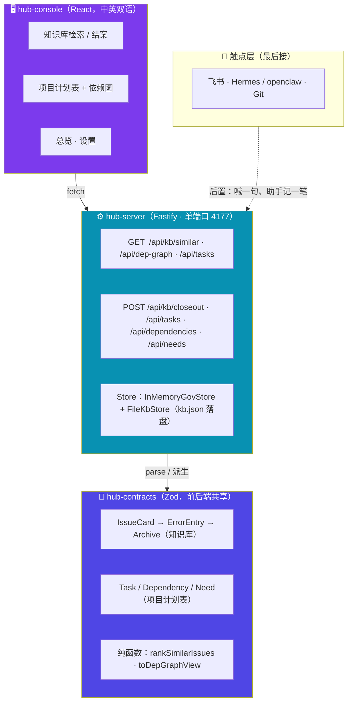
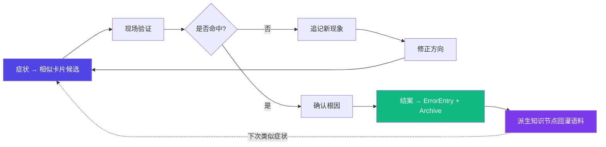

> **归档说明（2026-07-16 文档轮）**：这是公测前 README 的完整原文（截至 v0.24.x）。README 已重写为
> ~100 行的简洁门面，本文保留原版的痛点叙事、架构图、三支柱详解、设计底线全文与 v0.3 历史，
> 供想了解项目来龙去脉的人阅读。注意其中"库存/BOM 未落地"等表述已过时——库存页 2026-06-19 即已落地。

<div align="center">

# ⚡ Teamhub

### 机器人战队的内部协作工具 · 知识库 + 项目计划表 + 库存台账

**给学长减负、给学弟指引，进度表全员同步。<br />
有人卡住又不好意思开口时，让卡点在依赖图上自己显出来。不盯个人。**

<br />


</div>

---

## 一句话介绍

Teamhub 是给机器人战队（5–15 人小作坊）用的内部协作工具，三根支柱：

- **① 战队知识库**：规范、资料、调试归档放一处，跨赛季沉淀，撞上同类 bug 时把以前的解法翻出来。
- **② 项目计划表**：以任务为核心、全员可见的依赖图，卡住必须带原因（在等谁、等什么）。不画甘特，不按人头算天数。
- **③ 库存 / BOM**：排在最后做，等 AI 能帮它自己保鲜（读车图核电机数、算余量）再上，不先建一张没人填的静态表。

底座是三个包：`hub-server`（Fastify，单端口同时托管 API 和前端）、`hub-console`（React 控制台，中英双语）、`hub-contracts`（前后端共享的 Zod 契约）。

有一条底线（**核心不变式 I0**）：人手填的信号只回给本人当帮助，对第三方只暴露结构键（任务、组、资源），不暴露"谁慢了"。公平靠给被卡的人正名，不靠盯梢。AI 在这里只当仓管和转译（整理、检索、读图核对、起草），**不替人做治理判断**——谁卡了、该派谁、谁在摸鱼，这些一律交回给学长、大三自己看着办（见 D-039）。

> README 是对外门面；内部事实源以 `docs/planning/now.md` + `docs/planning/decisions.md` + `docs/design/` 为准。

---

## 痛点来源：真实调试现场

这个项目源于战队日常调试里的真实痛点。硬件调试现场的问题很少是完整、安静、能慢慢整理的，更多是突然冒出来：

- "串口又乱码了，但刚才好像还正常。"
- "CAN 总线偶发丢帧，复现条件不稳定。"
- "自动跑点方向不对，像是坐标系反了。"
- "换了个参数后电机抖了一下，但日志没来得及截。"
- "这个问题以前好像遇到过，但我找不到当时怎么解决的。"

调试时大家都在救火：看波形、接串口、改参数、重启设备、对比代码、跟队友同步现象。结果是：

| 现场问题 | 直接后果 |
|---|---|
| 问题记录很碎 | 事后无法复盘 |
| 排查过程丢失 | 不知道当时为什么这么判断 |
| 历史经验分散 | 同类 bug 反复踩坑 |
| 描述口语化 | 难以沉淀成团队知识 |
| 解决后不归档 | 经验不能复用 |

知识库这根支柱要解决的，就是"调试知识从现场碎片到可复用资产"的最后一公里。后来发现进度同步、库存盘点也是同一类痛点——东西散在各处、找一次要命——于是合并成了一套三支柱的协作工具。

---

## 当前架构

一套服务端 + 一个控制台 + 一份共享契约，三根支柱都长在上面：



几个要点：

- **单端口托管**：前端先构建成静态站，由 hub-server 一个端口（默认 4177）同时托管控制台和 API，不抢服务器的 80 / 443，不依赖系统全局 Node。
- **契约前后端共享**：schema 写在 `hub-contracts` 一处，前端请求体和后端校验都从它派生，不手抄两份。
- **状态优先派生**：能从飞书 / Git 既有动作派生的状态就不让人填；手填只当兜底。
- **触点层最后接**：飞书 / Hermes / openclaw / Git 这些外部触点统一最后接（一次接、多根受益），现在是 mock-first，壳子先立。

控制台当前有这些页面：总览、依赖图、知识库、项目计划表、设置；界面整体中英双语（`zh / en` 词条一一对应）。

---

## 三支柱

### 1️⃣ 战队知识库（KB）

把规范、资料、调试归档收进同一处，跨赛季沉淀，撞上同类问题时主动把旧解法翻出来。核心是从同源旧项目 **Probe_Flash** 移植过来的一条调试闭环：

```
一句话症状 → IssueCard → InvestigationRecord → ErrorEntry → ArchiveDocument
                                   │
                            rankSimilarIssues（相似检索）
                                   │
                       结案副产品自动派生 KnowledgeNode
```

- **相似 bug 提示**：给个症状，`GET /api/kb/similar` 返回 top-N 相近历史卡片。这是纯读取派生，见效快。护栏（A4）：只列候选、不断言同因，由人选用。
- **结案派生知识**：`POST /api/kb/closeout` 把一次结案变成 ErrorEntry + ArchiveDocument，并自动挂一个知识节点，下次同类症状能召回。
- **持久语料**：知识库落在 `~/teamhub-data/kb.json`（环境变量 `TEAMHUB_KB_DATA_FILE` 可改路径），重启不丢，结案会一直累积回灌。
- **一次性导入**：`npm run kb:import` 能把 Probe_Flash 的 `.debug-archive/` 历史归档一次性导进知识库（保留历史时间戳），实测拿真实档案跑过、CAN / UART 类问题能召回。

### 2️⃣ 项目计划表（PM）

以任务为核心、全员可见的进度视图。系统围着任务转，不围着人转。

- **依赖图主舞台**：任务连成 DAG，谁阻塞谁一眼可见；卡住的任务必须带原因——在等哪个上游任务、等什么缺口（Need），而不是"张三慢了"。
- **卡住带原因，不带人**："被什么卡住"收敛成结构键（任务 / 组 / 资源），由 `toDepGraphView` 从依赖边派生 `blockedByLabel`，不在任务上另存 `blockedBy`（避免双写）。
- **不画甘特、不按人算天数**：甘特预设了确定工期 / 顺序 / 硬截止，跟"无硬截止只轻提醒"的底线冲突，所以不做。也不算任何"谁快谁慢、在不在干活"。
- **录入即派生**：`POST /api/tasks` / `/api/dependencies` / `/api/needs` 建任务、连依赖、登记缺口；控制台有对应录入表单，依赖图上还能直接拖拽连线建依赖（前端守住自环 / 重边 / 成环）。
- **I0 守在写路径**：录入时收集的 `confirmedBy`（谁确认的）只作内部凭证，**永不经读视图暴露、永不参与排名**。拿带泄漏标记的探针 POST 进去，再 GET 读视图，响应里干干净净。

### 3️⃣ 库存 / BOM（INV，排最后）

零件余量台账 + 每车 BOM 核对 + 坏件追踪。这根**留着、重要，但排在最后做**，因为纯手录的静态表大概率重蹈"实验室资源表没人填"的覆辙（头号设计约束 P13）。

就绪条件是先有低门槛入口，不至于做成死表：

- **对话记账（主力）**：跟 Hermes / openclaw 说一句"坏了一个 3508、烧了"，助手帮记一笔、顺手更新台账。说句话是人本来就会做的动作，不是填表负担。
- **一次性盘点建底**：起步盘一次建底账，系统先存着，不用天天填。
- **看图算量（后续增强）**：AI 读车图自动数"每辆车几个电机、缺没缺"，再加上缺口主动汇报。

老实定位：它给的是"大概有什么、还有没有"，不是精确实时账。有人顺手拿走不吭声的漏堵不死，认了；"起码知道本来该有"本身就值。这根目前还是设计，没落地。

---

## AI 在这里的位置

第一轮明确把 AI 的"治理判断"暂缓了（D-039）。不是不用 AI，而是把它限定在**仓管 / 转译的安全车道**：整理、检索、拉资料、读图核对、算量、起草核对。它**不判定谁卡了、不自动派活、不算 silence / 排名**。

治理判断回归到人：系统只如实显示原始状态（A 做完了 / B 快忙疯了），由学长、大三自己看着协调。一旦判断主体是人，原先为"让 silence 不像监视"堆的那套去名机器（k-anon、受众路由、Cue 派生）就整套失去存在理由，一并挂起（设计稿留着，将来真要让 AI 参与治理判断时再取回）。I0 这条底线现在靠结构自然满足：第三方读视图里本来就没有人这一维。

落到知识库上，这条安全车道是这样跑的。调试很少是一次问答能结束的，多半得边验证边修正判断：



AI 给的是检查方向和候选，不是命令。波形和电机最终还得人去看。

---

## 设计底线

下游设计按编号引用这几条；唯一权威源是 `AGENTS.md §5`。

**核心不变式 I0（凌驾全部）**：人键输出只回本人当帮助，第三方只见结构键。`confirmedBy` 等含人信息的字段永不跨读视图边界。

**核心原则（C，产品根基）**

| # | 原则 | 一句话 |
|---|---|---|
| C1 | 填写成本必须由当下回报抵消 | 录入是兜底，状态优先从飞书 / Git 既有动作派生；比死掉的表更省事 |
| C2 | 让协作摩擦可见，让产能不可比 | 阻塞可见 ✓；任何角色（含老师）都不得见人效排名 ✗ |
| C3 | 小作坊优先 | 5–15 人；轻量，不做完整 RBAC / 多租户 / 大型 PM / PLM |
| C4 | AI 是仓管与转译者 | 输出是清单 / 候选 / 暴露的缺口，不替代实物验证与人的决定 |
| C5 | 只为有自然上游的场景构建 | 没有河流的水处理厂没用；状态必须有自然上游 |

**已挂起：治理专属原则（G）与反监视机器（A）**。这套是当年"让 AI 去判断人的状态"时堆出来的（silence 分河、give-floor、k-anon、受众路由、阈值派生）。D-039 把治理判断交回给人之后，它整套失去存在理由——spec 保留在 `decisions.md` D-032~D-035，代码本就近零、不删；复活触发条件 = 未来确认要让 AI 参与治理判断。

---

## 技术栈

| 层级 | 技术 / 形态 |
|---|---|
| 共享契约 | `hub-contracts`：Zod schema + 纯函数域逻辑（前后端共享一份 dist） |
| 服务端 | `hub-server`：Fastify，单端口托管 API + 静态控制台 |
| 控制台 | `hub-console`：React + TypeScript + Vite，中英双语，依赖图用 @xyflow |
| 持久层 | 知识库 `FileKbStore` 落盘 `kb.json`；治理数据当前内存态（`SqliteGovStore` 接口已留，未接） |
| 飞书 / 触点 | `lark-toolkit` / `lark-gateway`：飞书开放平台（企业内部应用 / webhook / API），统一触点最后接 |
| Skill 协议 | `.agents/skills/`：markdown + frontmatter + 关键词触发，三方共用（Claude Code / OpenCode / Codex），作为触点层契约底座保留 |
| v0.3 遗产 | React / Vite / Node HTTP / SQLite（已冻结，仅 git 历史） |

---

## 快速开始

### 启动协作中枢（hub-server）

根目录有个一键脚本：先把前端构建成静态站，再由 hub-server 单端口（默认 4177）同时托管控制台和 API。

```bash
git clone <你的仓库地址>
cd TeamHub
./start-teamhub.sh                        # 构建后前台启动，浏览器开 http://127.0.0.1:4177
TEAMHUB_SKIP_BUILD=1 ./start-teamhub.sh   # 已构建过、只重启
HUB_HOST=0.0.0.0 ./start-teamhub.sh       # 暴露到内网 / Tailscale 演示
```

知识库语料默认落在 `~/teamhub-data/kb.json`，重启不丢，结案会累积回灌；要换路径设 `TEAMHUB_KB_DATA_FILE`。

> 🔐 写端点（`POST /api/*`）已加鉴权（AUDIT H3）：绑 loopback（默认 `127.0.0.1`）时本机直接用；绑 `0.0.0.0` 暴露到内网时**必须**配 `TEAMHUB_WRITE_TOKEN`，否则 server 拒绝启动——`start-teamhub.sh` 未配会自动生成并打印一个 token。之后写请求要带 `Authorization: Bearer <token>`，读端点不受影响。暴露前把 token 换成强随机串（`openssl rand -hex 32`）。

### 导入历史调试归档（可选）

```bash
npm --prefix apps/hub-server run kb:import -- <archive 目录> <持久 kb.json 路径>
```

把 Probe_Flash 的 `.debug-archive/` 一次性导进知识库，再用 `TEAMHUB_KB_DATA_FILE` 指向同一文件启动 server，历史经验就能被召回。

### 用 Skill（调试现场轻量入口）

需要 Claude Code / OpenCode / Codex 任一。Skill 通过 `.agents/skills/` 提供，自动同步到各平台镜像。在 Claude Code 里直接说：

> "用 debug-checklist 帮我看下串口乱码这事"

Skill 协议会自动加载，产出带依据 + 验证动作的检查单。觉得有用就让它把结果走结案进知识库，攒着下次召回。

---

## 历史：v0.3 SPA 与 Skill / Bridge / Trail

### v0.3：完整交付的 SPA 形态（已冻结）

v0.3.0 是 2026-04 到 2026-05 初的一次完整交付：本地 HTTP + SQLite + workspace，IssueCard / InvestigationRecord / ErrorEntry / ArchiveDocument 全链路，用户目录部署 + systemd 自启 + 全套 verify。

代码原在 `apps/server` 和 `apps/desktop`，已于 2026-06-09（D-026 reframe）从工作区删除；完整代码保留在 **git 历史**中，精华提炼见 `docs/archive/v0.3-closeout/PROBEFLASH-V03-ESSENCE.md`。致命补丁走 `git revert` / `git checkout <sha> -- apps/server apps/desktop`。

### 为什么从 v0.3 转向

v0.3 本质是"跨组需求单"——为大组织异步协作 + 责任划分 + audit 设计的 issue tracker。但目标用户是小作坊：5–15 人面对面工作，群里吼一声就解决。v0.3 没人主动用不是工程缺陷，是形态与场景的结构性错配。冷静下来想明白：填者当下不受益的东西没人填。

### Skill / Bridge / Trail → 三支柱

转向后曾设想过三个 facet：Skill（调试检查单）/ Bridge（阻塞可见）/ Trail（赛季年鉴）。后来在 D-039 把方向重新瞄准：

- **Skill** 协议保留，降为触点层契约底座（`.agents/skills/`），调试检查单本身并入知识库的捕获入口。
- **Bridge** 的"阻塞可见"并入**项目计划表**的依赖图 + 阻塞归因。
- **Trail** 的"历史织成可读的样子"并入**知识库**的跨赛季沉淀。
- 这条演进只复用地基、不重写：`Task / Dependency / Need / Group / Member` + `KnowledgeNode` + console / server 壳全部沿用。

详细决策见 `docs/planning/decisions.md` D-037 → D-039 → D-041 → D-042。

---

## 当前边界

如实说明的限制：

- v0.3 SPA / SQLite / 旧 server 全部冻结，仅致命补丁。
- 三支柱里库存 / BOM 尚未落地（排最后，等 AI 能自保鲜再做）。
- 真实状态派生上游（Git / 飞书 → 进度）未接通，PM 的 `statusSource` 暂兜底 `console`，不宣称已解 C1 / C5。
- 写端点已加 Bearer 鉴权 + 限流（AUDIT H3），但仍未做正式部署上线（缺固定 IP / 战队服务器）。
- 治理 AI 派生整簇挂起，不判谁卡 / 不自动派活 / 不算排名。
- 不做权限系统、多租户、产能排名、绩效统计；不做完整 PLM / 大型 PM。
- 不做 RAG / embedding / 向量库（纯文本检索够用，到不够用再说）。
- 不抢服务器 80 / 443；不依赖系统全局 Node。
- AI / Skill / 触点层不读 / 不传 / 不打印密钥；飞书 token 走环境变量。
- 真实 Hermes / openclaw / 飞书 / Git forge 接入由用户线下配置；AI 只做 mock-first 与只读诊断。

---

## 项目定位

Teamhub 是给机器人战队这种 5–15 人小作坊用的内部协作工具，不打算做成万能 AI 助手：

- 问题突然冒出来时，知识库给个检查方向、把旧解法翻出来。
- 推进项目时，计划表让进度和卡点全员可见、被卡的人有处正名。
- 盘点物料时，库存台账（后续）让"还有没有、缺没缺"有个大概账。
- 新人进来时，能翻历史看前人是怎么趟过来的。

说白了，就是想让现场每一次救火都攒下点能复用的经验，让进度和家底都不靠口口相传。

---

<div align="center">

**Teamhub · 知识库 / 项目计划表 / 库存**

`hub-server` 托管 · `hub-contracts` 定契约 · 数据可落盘 · AI 只当仓管和转译

</div>
